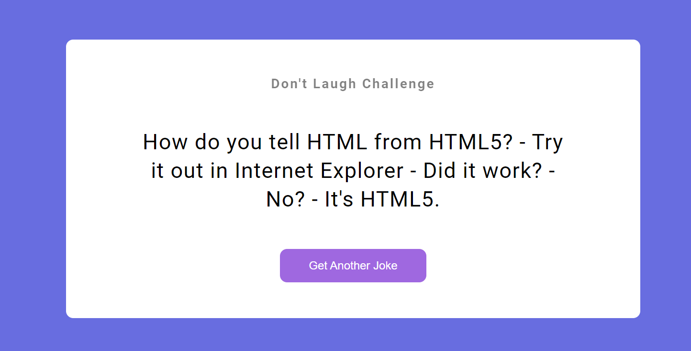

Project-5

# **Project-5** [Live Link](https://ineuronjsproject-6.netlify.app/)
 >- Skills gained in this project
 >- Learned about dom manipulation
 >- learned about fetch 
 >- learned about then and catch
 
 ***
 **Time taken to finish to this project**
 
 >-It took me 1 hour to complete this project 

 **Screenshot**
 